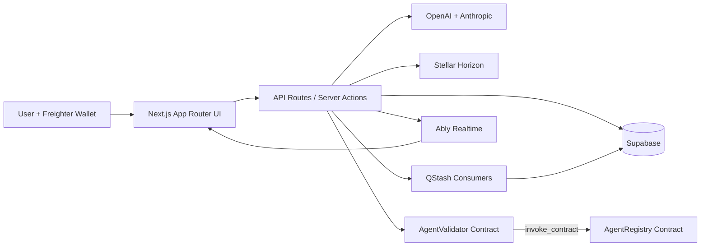

# AgentForge — The Execution Layer for Autonomous Agents on Stellar
Where users can Ideate, Build, Own, and Monetize Web3 AI agents via secure, on-chain execution sandboxes.

[](https://github.com/mesayanroy/0x402-pubsub/actions/workflows/ci.yml)

---

## 📺 Project Introduction & Video Demo

[](https://youtu.be/WlxBo90rBvU)
*Watch Sayan Roy introduce AgentForge and demonstrate the Web App, CLI, and on-chain workflow sandboxing: [https://youtu.be/WlxBo90rBvU](https://youtu.be/WlxBo90rBvU)*

---

## 🎙️ The AgentForge Vision

**Hello everyone, I'm Sayan Roy, and today I'm excited to introduce AgentForge.**

As AI agents become more capable, developers and traders face a growing infrastructure problem. Running autonomous agents requires cloud servers, storage, monitoring systems, execution environments, security controls, and payment infrastructure. These services are often expensive, fragmented, and difficult to manage.

Agent developers spend more time maintaining infrastructure than building agent logic, while traders lack a secure and programmable environment to deploy, test, and automate strategies. Existing solutions are typically centralized, costly to scale, difficult to audit, and provide limited agent autonomy, identity, and payment coordination. As a result, deploying and operating intelligent agents remains inaccessible for many builders and traders.

### Our Solution
AgentForge solves this by providing a **Stellar-native execution layer** where agents can own identities, execute workflows inside isolated **PRoot sandboxes**, interact with DeFi protocols, receive programmable payments, and operate through a unified command-line experience.

Instead of renting expensive cloud infrastructure or manually managing execution environments, developers can deploy agents directly into AgentForge's programmable execution layer.

AgentForge combines:
* **Agent Identity** & decentralized ownership
* **Workflow Orchestration** via DAG graphs
* **Sandboxed Execution** using low-overhead local PRoot environments
* **Programmable Payments** & automated agent micropayments
* **Agent Smart Wallets** for direct asset control and withdrawals
* **Auditability** via direct on-chain transaction verifications
* **Stellar-native Automation** for decentralized, serverless execution economics

### Why Stellar?
We chose Stellar because it provides exactly what autonomous agents need:
1. **Fast transaction finality** (3-5 second ledgers)
2. **Extremely low fees** (100 stroops standard fee)
3. **Soroban smart contracts** (verifiable Rust logic on-chain)
4. **Native asset support** (XLM, USDC, and custom tokens like AF$)
5. **Developer-friendly infrastructure** (Horizon & Soroban RPC)
6. **Scalable execution economics** 

Stellar allows agents to operate efficiently while keeping execution and payment costs low enough for real-world adoption.

---

## 🔗 Deployed Smart Contracts (Stellar Mainnet)

AgentForge is fully deployed and active on **Stellar Mainnet**. The system consists of 6 interlocking smart contracts that manage identity, validation, payment routing, and agent wallets:

1. **AF$ Token Contract**
   * **Contract ID**: `CDCW72YVMAE34IQSED3AQ7UHLKOWXLOMN2UQ2J5H4CKY357G2CHMOARL`
   * *Utility token for micropayment settling (1 XLM = 100 AF$).*
2. **Agent Registry Contract**
   * **Contract ID**: `CAOOSHR64NP2HIFMQE4LYLWAXPJM5VEUH6W7DYGQURHPM2W2GZDZPAW6`
   * *Canonical index storing agent pricing and ownership.*
3. **Agent Validator Contract**
   * **Contract ID**: `CDR4EEFL7OTXIJHD5ZR24J2VCO7THYIE3LGGRXJJY7W4WPCQ2QRO5ZY7`
   * *Validates deploy intent and enforces validation fees (5 XLM).*
4. **Payment Router Contract**
   * **Contract ID**: `CCPXCIERUHUJNBJITLR3MWKXTRTJ5E4ET2TEYGSXV72FRJS3RVAHNX3Q`
   * *Routes payments between owners and client runs.*
5. **Execution Manager Contract**
   * **Contract ID**: `CB6RDLOQFBJDFDQLX6QXS27F7QRZ3BIUADK5NJ33KUI24PMA7AIYZRVD`
   * *Coordinates sandboxed workflow steps and task fees.*
6. **Agent Smart Wallet Contract**
   * **Contract ID**: `CBEDEV6LHEXBZRP37H46HYXXWOYXSQVAUY6KG66SIYYUKFMEZCV3MEXF`
   * *Provides secure, on-chain custody and owner-authenticated withdrawals (custom Rust contract optimized down to 1,288 bytes).*

---

## ⛓️ Cryptographic Proofs & Mainnet Evidence

All operations are fully settled and verified on-chain. Below are live transaction proofs on **Stellar Mainnet** for all contract actions:

### 1. Smart Contract Deployment & Initialization
* **WASM Upload (Install Code)**
  * *Resource Fee*: `3.7307589 XLM` (Optimized WASM size: 1,288 bytes)
  * *Tx Hash*: [`6b4095fdf5a122d5c74023eaa0846b42a969a9ab46edfd0176f1ca1d8d5b8ca1`](https://stellar.expert/explorer/public/tx/6b4095fdf5a122d5c74023eaa0846b42a969a9ab46edfd0176f1ca1d8d5b8ca1)
* **Instance Creation (Deploy Wallet)**
  * *Resource Fee*: `0.2014522 XLM`
  * *Tx Hash*: [`3db896d250aa7a46e1f26bf63119db30279e2fd24bd84135d99d2f5b40a986f6`](https://stellar.expert/explorer/public/tx/3db896d250aa7a46e1f26bf63119db30279e2fd24bd84135d99d2f5b40a986f6)
* **Wallet Initialization**
  * *Tx Hash*: [`1323b879212f999e80f9b800fc4ccdf4243160d8bc8ddcb878615b3669372425`](https://stellar.expert/explorer/public/tx/1323b879212f999e80f9b800fc4ccdf4243160d8bc8ddcb878615b3669372425)

### 2. Smart Wallet Token Transfers
* **AF$ Token Deposit (250.00 AF$ from Owner to Agent)**
  * *Tx Hash*: [`8145a513698791d6c922fa0f42eb37a39e4afa7b6d64a832aeccee5ce47444ef`](https://stellar.expert/explorer/public/tx/8145a513698791d6c922fa0f42eb37a39e4afa7b6d64a832aeccee5ce47444ef)
* **AF$ Token Withdrawal (50.00 AF$ from Agent back to Owner)**
  * *Tx Hash*: [`36a051e77f1348e03ea944a21d5ea1108d64b77888588d20b3cf2ac09a7ab3ef`](https://stellar.expert/explorer/public/tx/36a051e77f1348e03ea944a21d5ea1108d64b77888588d20b3cf2ac09a7ab3ef)

### 3. Automatic 0x402 Micropayment Settlement
* **Automatic Micropayment Deduction (1.00 AF$)**
  * *Tx Hash*: [`59ca80e58dd6f160f6130cdc5f79534c65be641af03405263afa22268e66a2be`](https://stellar.expert/explorer/public/tx/59ca80e58dd6f160f6130cdc5f79534c65be641af03405263afa22268e66a2be)

### 4. Marketplace & Forking Economy (Testnet Verification)
* **Agent Marketplace Forking (0.1 XLM Forking Fee)**
  * *Tx Hash*: [`0367f4f328678305d283ed8fc7b71866df5f0523e7efa3ef00bb3abc2b77e541`](https://stellar.expert/explorer/testnet/tx/0367f4f328678305d283ed8fc7b71866df5f0523e7efa3ef00bb3abc2b77e541)

---

5+ active users with their Name, Wallet ID, email and Feedback:
https://docs.google.com/spreadsheets/d/1vLztvp1yzuMoxyTsJxFebRteebIhMIdvP6aaxCJ9CrQ/edit?usp=drivesdk

Full architecture document: [docs/architecture/ARCHITECTURE.md](docs/architecture/ARCHITECTURE.md)

It combines:
- Soroban contracts for on-chain registry and deployment validation
- HTTP 0x402 protocol to AI - AI, pay-per-request execution in XLM
- Wallet-signature UX with Multiwallet auth
- Realtime pub/sub pipeline for events and analytics
- Agent marketplace, fork economy, workflow executor, and trading surface

---

1. fork-wallet-confirm.png

2. stellar-explorer-proof.png

3. marketplace-fork-success.png

4. run-payment-modal.png

5. run-summary-live-feed.png

6. build-validation-sign.png

7. trading-surface.png

8. workflow-waiting-signature.png

9. workflow-invoice-confirmed.png

10. dashboard-analytics.png


After adding images, commit and push. The main README references these paths directly.

## Why This Project Exists

AI agents are easy to build but hard to monetize safely across open networks. Traditional API keys and off-chain billing create trust gaps:
- No atomic link between payment and execution
- No shared payment standard between autonomous clients
- No transparent, verifiable evidence that value moved

AgentForge addresses this by pairing 0x402 style payment negotiation with Stellar transactions and on-chain policy enforcement.

## Why Stellar (and Soroban)

Stellar is a strong fit for machine-to-machine micro-payments and agent marketplaces:
- Fast finality and low fees for frequent small-value API calls
- Mature account model and strong wallet ecosystem (Freighter)
- Great UX for memo-tagged payments, which map naturally to request IDs
- Soroban smart contracts for deterministic validation and inter-contract control
- Publicly verifiable transaction proofs through Horizon / Explorer

## Core Capabilities

- Build custom agents with model, prompt, tools, visibility, and pricing
- Register agents with validator + registry contract flow
- Run agents through a 402 payment challenge-response mechanism
- Fork marketplace agents with paid fork transactions
- Execute paid workflow tasks with invoices and explorer proofs
- Track activity in dashboard and live feed components

## High-Level Architecture




## End-To-End Workflow (Start To Finish)

### 1) Wallet Connect And Identity
1. User opens the app and connects Freighter (or other supported wallet).
2. Public key is stored locally for session-scoped UX and request signing context.
### 2) Agent Build + On-Chain Validation
1. User configures agent metadata (name/model/prompt/price/visibility/tools).
2. `POST /api/agents/validate-deploy` builds a Soroban validation transaction (XDR).
3. User signs in wallet.
4. `POST /api/agents/confirm-deploy` submits and prepares confirmation call.
5. Validator contract confirms and performs inter-contract call to registry.
6. Agent metadata is persisted to Supabase for app indexing and search.

### 3) Marketplace Listing + Fork Economy
1. Public agents appear in marketplace cards.
2. Consumer can fork an existing agent by paying fork fee in XLM.
3. Memo ties payment to fork action (`fork:<agent-or-request-id>`).
4. Forked configuration can be customized before first execution.

### 4) 0x402 Request Execution
1. Client calls `POST /api/agents/[id]/run` with prompt input.
2. If unpaid, server returns payment challenge (402 semantics + payment details).
3. Wallet signs and submits Stellar payment.
4. Client retries with tx hash and wallet headers.
5. Server verifies payment via Horizon and executes selected model.
6. Request, billing, and runtime stats are persisted.

### 5) Trading + Workflow Executor
1. Trading page simulates strategy actions with XLM-centric UX.
2. Workflow page batches paid task executions and wallet approvals.
3. Invoice card records amount, tx hash, payer, timestamp, and explorer link.

### 6) Observability And Analytics
1. Realtime events stream through Ably/QStash pipeline.
2. Dashboard aggregates request counts, billing, and latency surfaces.
3. Explorer links provide independent payment proof.

## Smart Contracts

### AgentValidator (`contracts/agent_validator`)
- Validates deploy intent and confirmation signatures
- Manages pending deployment state
- Performs inter-contract call into registry during confirmation

### AgentRegistry (`contracts/agent_registry`)
- Canonical on-chain index for registered agents
- Holds pricing/ownership metadata and request accounting hooks
- Serves as the source of truth for validator cross-contract checks

### Inter-Contract Call Flow

```text
Client -> validate-deploy API -> sign tx -> confirm-deploy API
-> AgentValidator.confirm_deploy(...)
-> invoke_contract(AgentRegistry.register_agent(...))
-> on-chain registration success
```

## Validation Screens (Important One-Liners)

1. Freighter fork confirmation proves user-signed payment authorization before marketplace fork completes.
2. Stellar Expert receipt confirms fork tx finality, ledger inclusion, memo integrity, and signature validity.
3. Marketplace success banner shows app-level acknowledgment wired to confirmed chain payment.
4. Run-agent payment modal demonstrates 402 challenge-response UX tied to wallet signature.
5. Agent run summary shows billed amount and runtime metadata linked to the paid execution path.
6. Build step validation modal proves deploy flow requires explicit wallet approval before contract submission.
7. Confirm-deploy warning state highlights guarded confirmation path for potentially failing preconditions.
8. Trading surface demonstrates XLM-focused strategy execution context integrated with wallet identity.
9. Workflow executor waiting state proves asynchronous task orchestration blocked on wallet payment signature.
10. Workflow invoice panel provides structured proof payload: tx hash, payer, amount, timestamp, explorer link.
11. Dashboard panels aggregate monetization telemetry and request analytics after protocol interactions.

## API Surface

- `POST /api/agents/create`
- `GET /api/agents/list`
- `GET /api/agents/[id]`
- `POST /api/agents/[id]/run`
- `POST /api/agents/validate-deploy`
- `POST /api/agents/confirm-deploy`
- `POST /api/agents/submit-confirmation`
- `POST /api/payment/verify`
- `GET /api/dashboard/analytics`
- `GET /api/dashboard/requests`
- `GET /api/ably/token`

## Local Development

### Prerequisites
- Node.js 18+
- pnpm 10+
- Freighter wallet (for end-to-end payment/deploy tests)
- Supabase project (recommended for full mode)

### Install

```bash
pnpm install
```

### Configure Environment

Create local env and fill your own keys (never commit secrets):

```bash
cp .env.example .env.local
```

### Run

```bash
pnpm run dev
```

### Build

```bash
pnpm run lint
pnpm exec tsc --noEmit
pnpm run build
```

## CI/CD Pipeline

Workflow file: `.github/workflows/ci.yml`

1. `lint-and-type-check`: ESLint CLI + TypeScript noEmit
2. `build`: Next production build + artifact upload
3. `docker-build`: Docker buildx image build (no push)

This pipeline ensures code quality, type safety, production build integrity, and deploy parity.

## Security Notes

- `.env.local` and `.env.local.bak` are ignored and must remain local only.
- Never commit API keys, private keys, or service-role secrets.
- If a key is ever exposed, rotate it immediately.

## Project Vision

AgentForge demonstrates that autonomous software can be monetized transparently when identity, payment, and execution are composed as one protocol surface.

By building on Stellar, the project converts abstract AI usage into verifiable economic events that users, builders, and integrators can trust.
